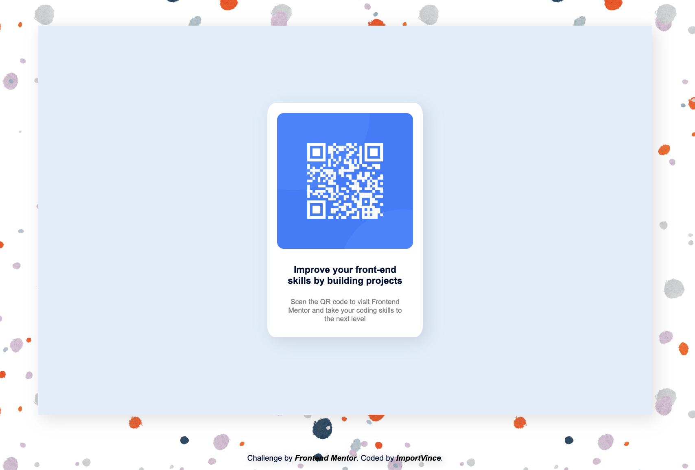

# Frontend Mentor - QR code component solution

This is a solution to the [QR code component challenge on Frontend Mentor](https://www.frontendmentor.io/challenges/qr-code-component-iux_sIO_H). Frontend Mentor challenges help you improve your coding skills by building realistic projects. 

## Table of contents

- [Overview](#overview)
  - [Screenshot](#screenshot)
  - [Links](#links)
- [My process](#my-process)
  - [Built with](#built-with)
  - [What I learned](#what-i-learned)
  - [Useful resources](#useful-resources)
- [Author](#author)

## Overview

First task ever in Front End Mentor. The goal was to take some simple text and turn it into what is seen below. 

### Screenshot

### Links

- Solution URL:[github](https://github.com/importvince/QR-Code)
- Live Site URL: [live site URL](https://your-live-site-url.com)

## My process

### Built with

- Semantic HTML5 markup
- CSS custom properties
- Flexbox

### What I learned

I learned how to use background-image in CSS...not sure how much I like it. 

### Useful resources

- [w3schools](https://www.w3schools.com/cssref/pr_background-image.php) - As always, the go to for random googles. This one helped me with background-image. 

## Author
- Frontend Mentor - [@importvince](https://www.frontendmentor.io/profile/importvince)
